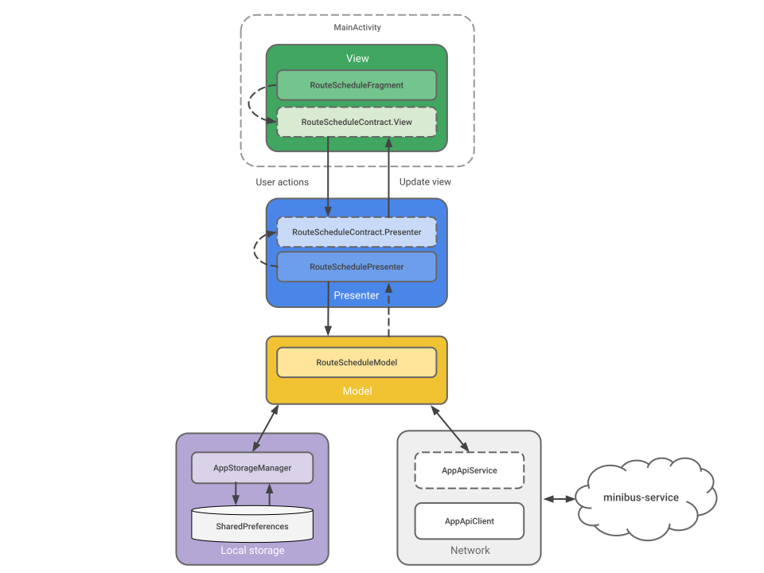

# minibus-app
MVP + Java + RxJava2 + Dagger 2 + ButterKnife + Retrofit 2

A simple demo application for displaying bus schedules among 6 cities, which also includes a calendar of operating days, timeline filtering, user session, and trips booking management. Supports light and dark themes.

Designed for demo purposes only. Depends on [minibus-service](https://github.com/n3gbx/minibus-service) repository

[app-debug.apk](./demo/app-debug.apk), points to locally running service at 10.0.2.2:3000 (using emulator)

[app-stage.apk](./demo/app-stage.apk), points to cloud based service

## Recordings demonstrating core functionality
|Authentication|Filtering|Sorting|Booking|
|------|------|------|------|
|<video src="https://github.com/user-attachments/assets/cadc33bf-4d72-4595-ab47-980d6036bfbd" height="480">|<video src="https://github.com/user-attachments/assets/d0cf42cc-564b-4c0c-aa85-ad92af32d8bf" height="480">|<video src="https://github.com/user-attachments/assets/10b89dd4-a498-481a-bd15-14a76a84c486" height="480">|<video src="https://github.com/user-attachments/assets/c76ba75d-8b4d-4742-95dc-16b34482a388" height="480">|

## Architecture diagram

