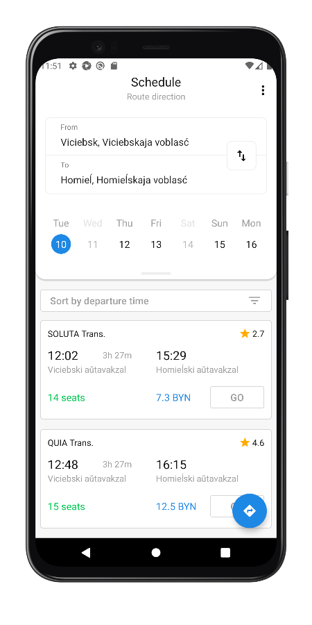
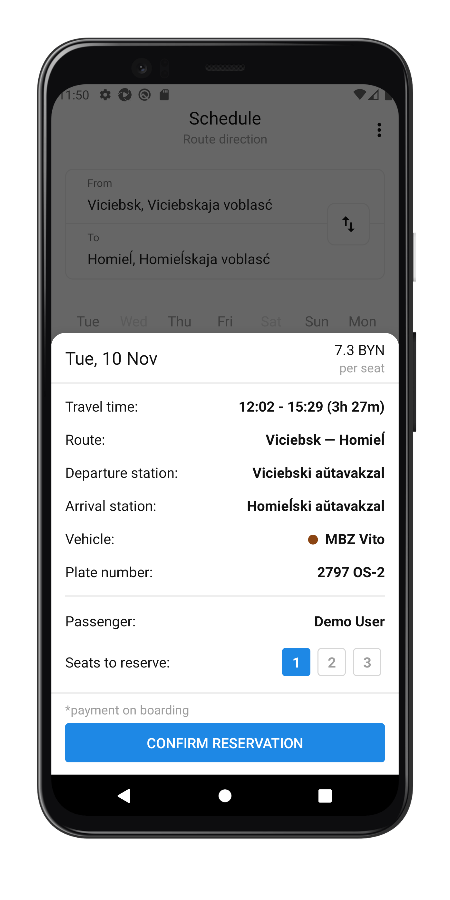

# minibus-app
MVP based + RxJava2 + Dagger 2 + ButterKnife + Retrofit 2

A simple demo application for displaying bus schedules among 6 cities, which also includes a calendar of operating days, timeline filtering, user session, and trips booking management. 

Designed for testing purposes only. Depends on [minibus-service](https://github.com/n3gbx/minibus-service) repo

[app-debug.apk](./demo/app-debug.apk), points to local service at 10.0.2.2:3000 (using emulator)

[app-stage.apk](./demo/app-debug.apk), points to herokuapp

  
  
  

